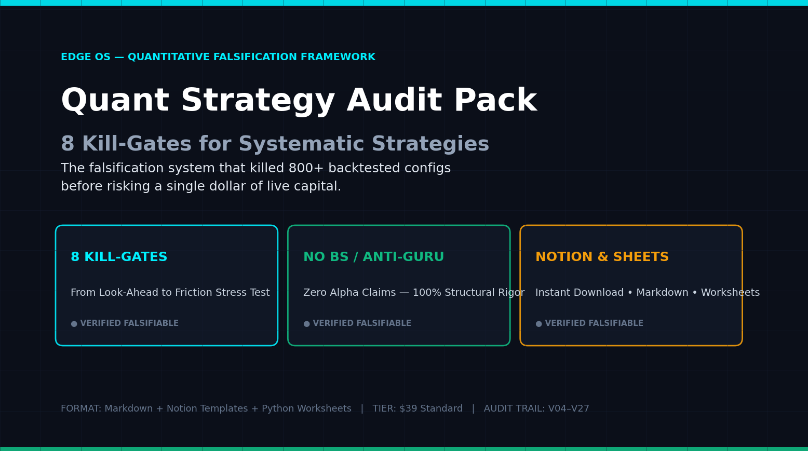
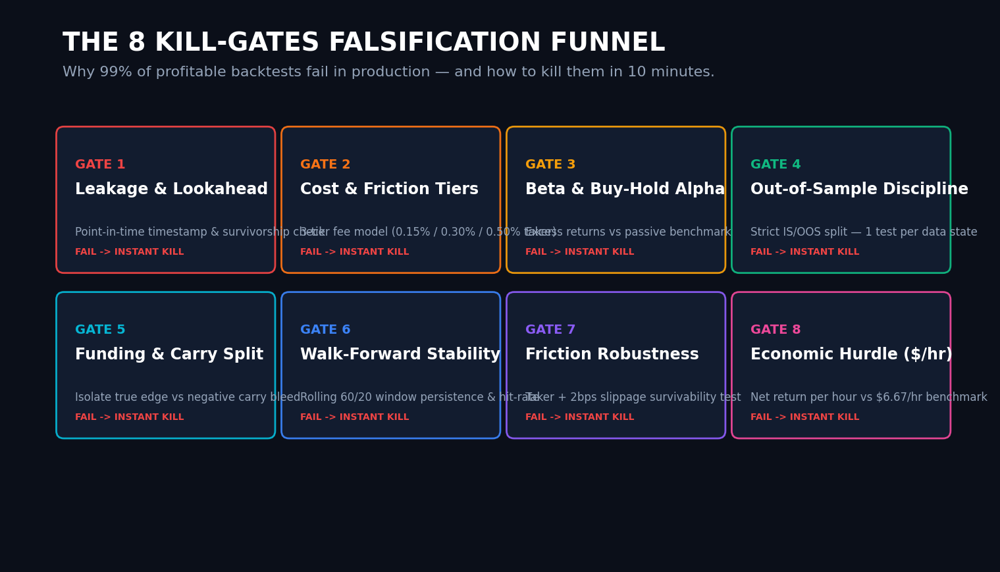
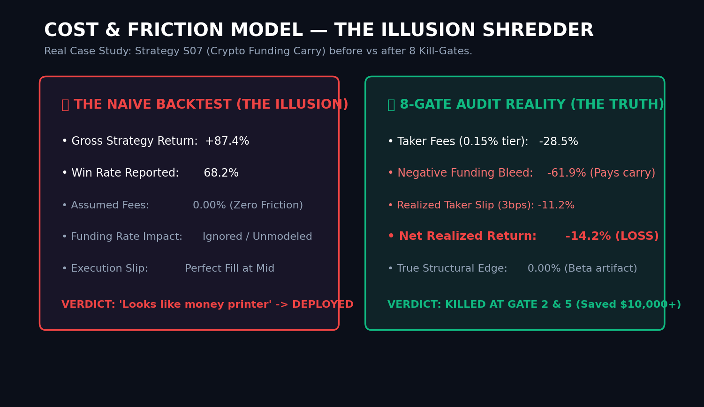

# Edge OS — Systematic Strategy Audit & Data Infrastructure

> **STATUS 2026-08-31:** All open-source audit tools and sample datasets are **LIVE**. Full 6-section pack available on Gumroad: [**Quant Strategy Audit Pack — 8 Kill-Gates ($39)**](https://gumroad.com/l/yjpxkw)

---

## 🛡️ 1) Quant Strategy Audit Pack (The 8 Kill-Gates)

Most backtests fail in production because of hidden structural traps: look-ahead leakage, unmodeled taker fees, negative funding carry bleed, and timestamp misalignment.

The **8 Kill-Gates Framework** is a systematic falsification checklist built to stress-test and **kill unprofitable trading strategies in 10 minutes** before risking real capital.

### What You Get:
- **Free 1-Page Lite Scorer:** [`quant_audit_lite_1page.md`](quant_audit_lite_1page.md) — The 8 core falsification gates on a single page. 100% free and instantly usable.
- **Full Institutional Audit Pack ($39):** [`quant_audit_pack_full.md`](quant_audit_pack_full.md) — 6 complete modules including:
  1. 8 Quantitative Kill-Gates with PASS/CONDITIONAL/KILL thresholds
  2. Backtest Data Integrity & Leakage Checklist
  3. Interactive Cost & Friction Model Worksheet (Taker fees + Carry + Time hurdle)
  4. Walk-Forward Persistence & Regime Stability Worksheet
  5. 7-Criteria Strategy Kill-Gate Scorer
  6. Standardized Strategy Post-Mortem & Reporting Template
  - **Direct Purchase on Gumroad:** [**gumroad.com/l/yjpxkw**](https://gumroad.com/l/yjpxkw) (Instant Download, Notion & Markdown Ready).

---

## 📊 2) The Friction & Carry Reality Check

Why "Gross +87%" strategies turn into Net -14% losses when deployed:

---

## ⚡ 3) Normalized Funding Rate Data & Mock API

300 point-in-time normalized Binance funding records (BTCUSDT/ETHUSDT) with verified UTF-8 encoding and zero look-ahead bias:

- **Sample Datasets:** [`sample_funding_rates.json`](sample_funding_rates.json) / [`sample_funding_rates.csv`](sample_funding_rates.csv)
- **API Documentation:** [`docs.md`](docs.md) — PIT guarantees, normalized schema, and funding carry edge analysis.
- **Pricing & Tier Roadmap:** [`pricing.md`](pricing.md) — Demo $0 / Basic $9/mo / Pro $29/mo.

**Mock Endpoint:** `GET /v1/funding?symbol=BTCUSDT&exchange=binance&limit=100`

---

## 📈 Transparent Funnel Tracking

| Funnel Stage | D2: Quant Audit Pack ($39) | D1: Normalized Data API ($9) |
|---|---|---|
| **Discovery** | Gumroad Discover + GitHub Pages | RapidAPI Category + GitHub Docs |
| **Free Evaluation** | [Download 1-Page Lite](quant_audit_lite_1page.md) | [Sample JSON / CSV](sample_funding_rates.json) |
| **Full Version** | [**Gumroad Direct ($39)**](https://gumroad.com/l/yjpxkw) | [API Pricing Tiers](pricing.md) |

*All experiments and conversion events are publicly timestamped in `V28_tracking.csv`.*

